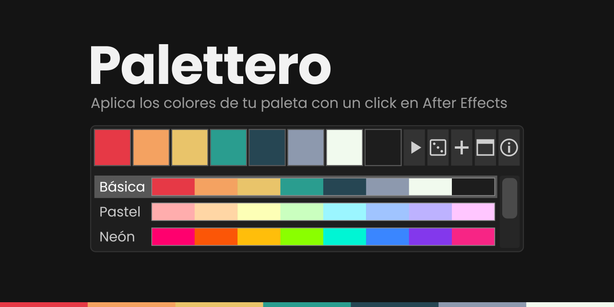

# Palettero

Panel para After Effects con una fila de cuadrados de color. Se puede dejar como una franja
fina encima del visor y sigue siendo útil a ese tamaño: los cuadrados se encogen para caber
y las opciones solo aparecen al estirar el panel hacia abajo.

Probado en After Effects 2026 (26.3) sobre Windows 11 y en After Effects 2022 (22.3) sobre
macOS Monterey.

## Instalación

1. Descarga `Palettero.jsxbin` de la última release.
2. Cópialo en la carpeta `ScriptUI Panels` de After Effects:
   - Windows: `C:\Program Files\Adobe\Adobe After Effects <versión>\Support Files\Scripts\ScriptUI Panels`
   - macOS: `~/Library/Preferences/Adobe/After Effects/<versión>/Scripts/ScriptUI Panels`
     (créala si no existe; la carpeta de la aplicación pide permisos de administrador)
3. Reinicia After Effects y abre el panel desde **Window > Palettero.jsxbin**.

Si el enlace de la ventana de información no abre el navegador, activa **Allow Scripts to
Write Files and Access Network** en las preferencias de **Scripting & Expressions**.

## Uso

| Acción | Windows | macOS |
|---|---|---|
| Cambiar el color de una muestra | Click | Click |
| Aplicar el color a la selección | Alt+click | Option+click |
| Crear un sólido de ese color | Ctrl+click | Cmd+click |
| Quitar esa muestra de la paleta | Shift+click | Shift+click |

Aplicar el color cambia las propiedades de color seleccionadas o, si no hay ninguna, las capas
de sólido, texto y los rellenos de forma seleccionados. El sólido nuevo se crea encima de la
capa seleccionada. Las dos acciones ponen el HEX exacto, se deshacen con Ctrl+Z (Cmd+Z en Mac)
y no tocan las capas bloqueadas.

A la derecha de las muestras hay cinco botones:

- Triángulo: paleta siguiente. Con Alt (Option en Mac), la anterior.
- Dado: genera una paleta aleatoria en «Aleatoria».
- «+»: añade un color al final de la paleta, también con el panel como franja fina.
- Ventanita: abre la franja flotante.
- «i»: versión, atajos y enlace a la web.

Al estirar el panel aparecen las opciones. Arriba, todas las paletas en filas, cada una con su
nombre y sus colores; un click en una fila la activa. Cuanto más alto es el panel, más filas
se ven, y si no caben todas aparece una barra para desplazarlas. Debajo van los botones en dos
grupos. El de la paleta tiene Guardar como…, Renombrar… y Eliminar. El de los colores tiene
Añadir color, Quitar color (quita la última muestra) y Aleatoria. Si el panel es estrecho, los
grupos bajan de fila en lugar de cortarse. Trae cinco paletas de partida.

## El cuentagotas y la franja flotante

En macOS, el cuentagotas de Solid Settings y del selector de color lee las muestras del panel
directamente, con el valor exacto. macOS puede pedir permiso de **Grabación de pantalla** para
After Effects al usar el cuentagotas; para leer Palettero no hace falta concederlo.

En Windows no. Mientras esos diálogos están abiertos, After Effects pinta en gris todos sus
paneles acoplados y el cuentagotas no puede leer la paleta. Pasa con cualquier panel de
scripts, no es algo que Palettero pueda evitar. Para esos casos está la franja flotante. Es una ventana aparte que se queda encima de After
Effects y conserva sus colores con el diálogo abierto. Muestra la misma paleta que el panel,
cualquier cambio se ve en los dos y recuerda su posición y tamaño. También se abre sola si
ejecutas el archivo desde **File > Scripts > Run Script File…**.

El cuentagotas de las propiedades de color en Effect Controls no abre ningún diálogo y lee
también el panel acoplado.

En Windows, el cuentagotas no siempre devuelve el HEX exacto: en las pruebas, #2A9D8F llegó
como #2C9D8F y #E63946 como #D93642. Si necesitas el valor exacto, usa los atajos de la tabla.

## Dónde se guardan las paletas

En las preferencias de After Effects, como texto. Duran entre sesiones, pero cada versión de
After Effects tiene sus propias preferencias: al actualizar, las paletas no pasan solas a la
versión nueva.

## Cambios

Ver [CHANGELOG.md](CHANGELOG.md).

## Licencia

Gratis, para uso personal y comercial. Se distribuye solo compilado: el código fuente no se
licencia. Detalles en [LICENSE.md](LICENSE.md).
